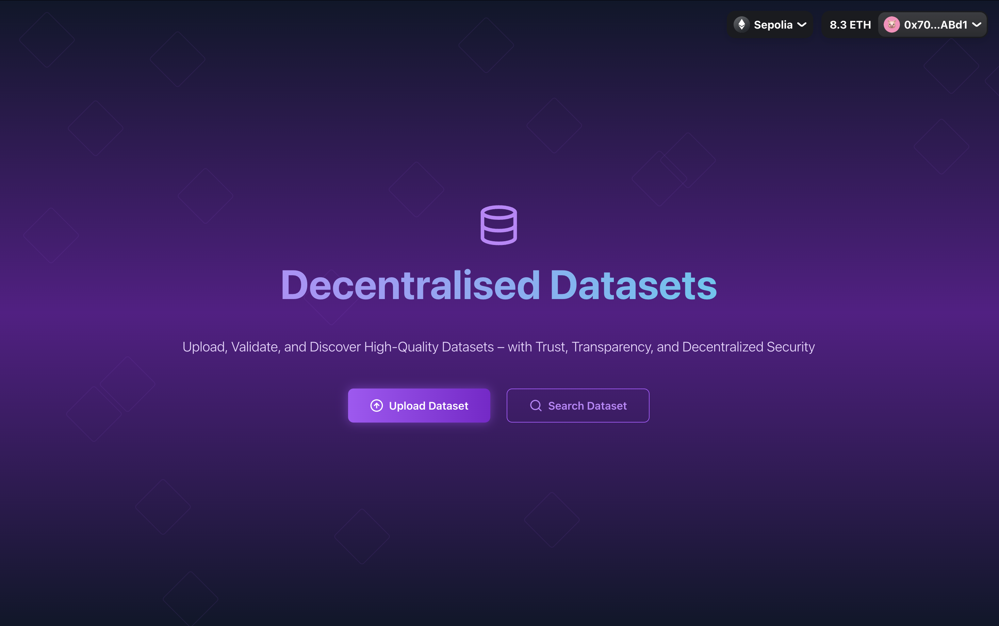
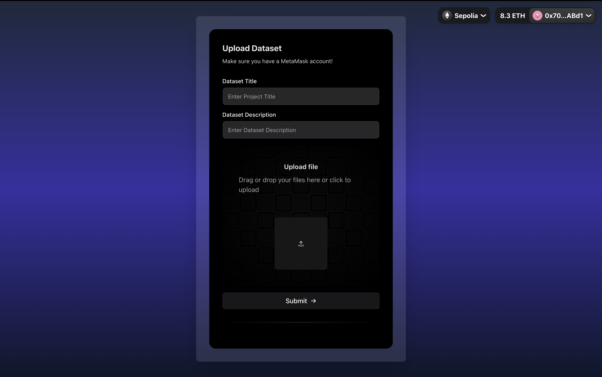
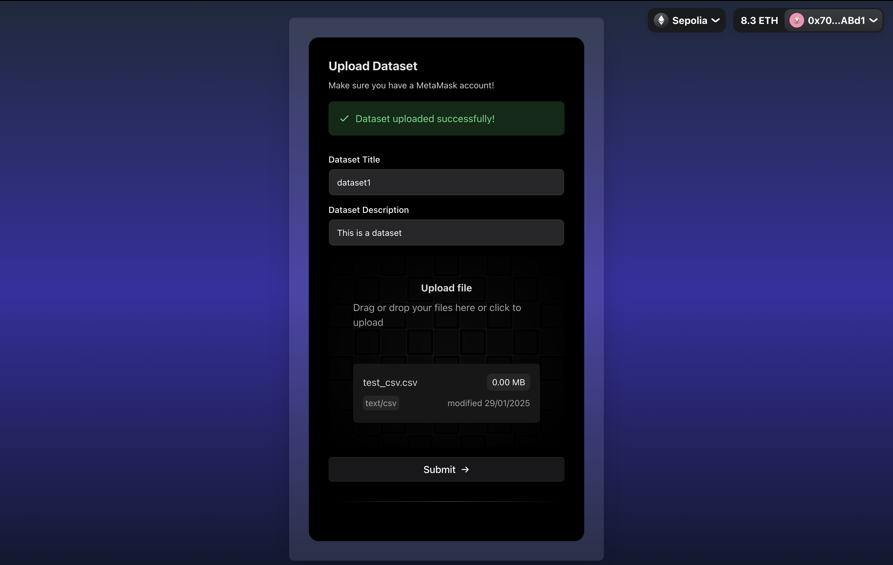
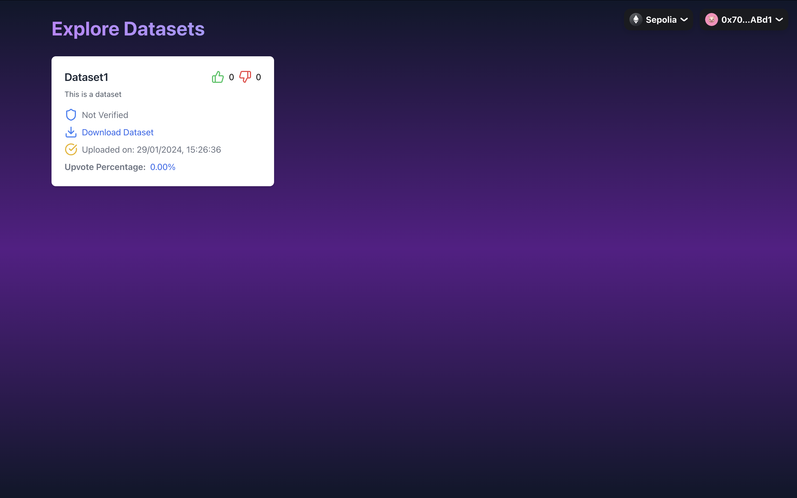

# Decentralized Datasets 🔗

A dApp for dataset sharing and verification through blockchain technology. Users can upload datasets that undergo community verification, with a robust voting system ensuring data quality and reliability. Built with Next.js and Solidity, featuring a modern crypto-themed UI and decentralized storage solutions.

## 📸 Screenshots






## ✨ Features

🔐 **Secure Dataset Storage**
- Upload and store datasets on IPFS
- Immutable records on the Ethereum blockchain
- Complete data ownership and transparency

🗳️ **Community Validation**
- Decentralized verification system
- Earn rewards for verifying datasets
- Build trust through consensus

⭐ **Quality Rating System**
- Upvote/downvote mechanisms
- Track dataset popularity
- Surface high-quality content

💎 **Web3 Integration**
- Seamless wallet connection
- Real-time blockchain updates


## 🛠️ Tech Stack

[](https://skillicons.dev)

- **TypeScript** - Type-safe development ensuring robust code
- **Next.js** - Lightning-fast page loads with App Router
- **Solidity** - Secure smart contracts for dataset management
- **Tailwind** - Stunning responsive design with zero overhead
- **Node.js** - Efficient development environment
- **Hardhat** - Smart contract development and testing framework
- **The Graph Protocol**  - Indexing and querying blockchain data
- **Pinata**-  scalable storage through IPFS

## 🚀 Getting Started


### Installation

1. Clone the repository
```bash
git clone https://github.com/AtharvaD-coder/Decentralised-Datasets.git
cd frontend
```

2. Install dependencies
```bash
npm install
```

3. Set up environment variables

### Running Locally

1. Start the development server
```bash
npm run dev
```

2. Open [http://localhost:3000](http://localhost:3000)

3. Connect your Web3 wallet to interact with the dApp

## 🎯 Usage

✅ Upload Datasets effortlessly to IPFS with immutable blockchain records.

🔍 Verify and Vote decentralized datasets validation through community-driven voting.

📊 Discover and Download  datasets, filter by ratings, and download high-quality data.

💰 Earn Rewards for verifying datasets and contributing to the network.

🔗 Seamless Web3 Experience. Connect your wallet, interact with smart contracts, and stay updated in real-time.
